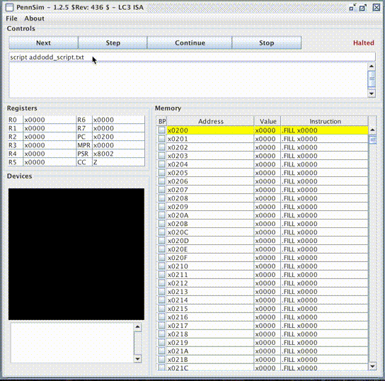
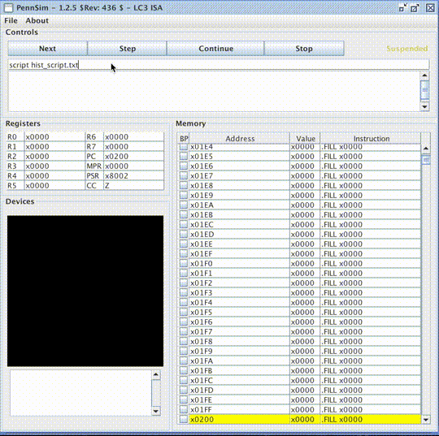

# LC3 Programs
Below are a few programs that were used to learn the LC3 architecture and assembly programming system.

## General Note
Note make sure to open the PennSim jar within the folder where the code exists.  
```bash
cd ~/PATH/TO/LC3/ASM/
java -jar ../PennSim.jar
```  

Inside the PennSim applicaton run:  

```bash
script {PROGRAM_NAME}_script.txt
```

## Add Odd Program
  
This program adds all the odd numbers between two user inputs and prints out the sum. The program can take each input from 1-99 and halts if the second number is less than the first number. Jump statements were not allowed during the implementation of the program and resulted in the quirky implementation using "routing" unconditional branch sections.

## Histogram Program
  
This program loads in from memory a list of values specified by another assembly file, scales the values if they are too few (less than 62 instances), and displays the data. The input data is constrained from 0 to 127, inclusive and count of each data point is constrained from 0 to 123, inclusive. This is because of the constraints of the LC3 OS Display which is 128 x 124 pixels.  
The helper python script generates testing data for the program:  
```bash
./generate_random.py [TEST_CASE]
```  
The script tests the scaling functionality (TEST_CASE = 1 and 2) and also generates random data (TEST_CASE = 0) which is pictured above.  
Note: the .asm for this specific lc3 os which makes the display accessible was not made available.

## Invaders Program
  
This program emulates the popular space invaders game on the lc3 platform. The ship is controlled with AD for left and right and space to shoot a laser. Below is a table listing the game's controls.  

| Keypress | Result                      |
|----------|-----------------------------|
| a        | Move ship left              |
| d        | Move ship right             |
| space    | Shoot laser                 |
| q        | Quit game                   |
| r        | Change ship color to red    |
| g        | Change ship color to green  |
| b        | Change ship color to blue   |
| y        | Change ship color to yellow |
| w        | Change ship color to white  |  

When a laser hits a ship the ship's color changes from blue to red. When all four ships have been hit the program halts and prints GAMEOVER into the console.